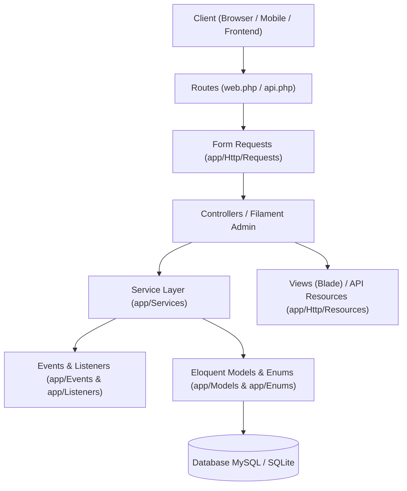

# 🏛️ Panduan Arsitektur & Struktur Kode — Dantie Stiker

Dokumen ini disusun sebagai panduan teknis bagi seluruh pengembang (*software engineers*) yang akan memelihara, mengembangkan, dan memperluas aplikasi **Informasi Pemesanan Wrapping (Dantie Stiker)**.

---

## 1. Ringkasan Arsitektur Sistem

Aplikasi ini dibangun menggunakan arsitektur **Layered Architecture (Arsitektur Berlapis)** berbasis **Laravel 11 (PHP 8.2+)** dengan prinsip pemisahan tanggung jawab (*Separation of Concerns*):



### Prinsip Utama yang Diterapkan:
1. **Skinny Controllers, Fat Services:** Controller hanya menerima input HTTP, memanggil Service, dan mengembalikan respon. Logika bisnis terlarang ditulis langsung di Controller.
2. **Form Request Validation:** Seluruh validasi input berada di `app/Http/Requests/` untuk menjaga keamanan dan kebersihan controller.
3. **Type-Safety & PHP Backed Enums:** Status dan konstanta sistem menggunakan Enum PHP 8.1+ (`BookingStatus`, `OrderStatus`, `PaymentType`, `PaymentStatus`).
4. **Event-Driven Side Effects:** Pengiriman notifikasi email, WhatsApp URL, atau audit log dijalankan melalui Events & Listeners agar tidak membebani alur request utama.
5. **Modern Admin Panel:** Panel administrasi menggunakan **Filament v3** yang modular dan terisolasi di `app/Filament/`.

---

## 2. Peta Struktur Folder & Tanggung Jawab

```text
informasi_pemesanan_wrapping/
├── app/
│   ├── Enums/            # Tipe data enum (Status, Metode Bayar, Jenis Notifikasi)
│   ├── Events/           # Event kelas (OrderCreated, BookingCreated, PaymentUploaded)
│   ├── Exceptions/       # Custom business exceptions (SlotPenuhException, dll.)
│   ├── Filament/         # Panel Admin Filament v3
│   │   ├── Pages/        # Custom pages (Kalender Booking, Profil Admin)
│   │   ├── Resources/    # CRUD Resources per domain (Bookings, Pesanans, Layanans, Users)
│   │   └── Widgets/      # Widget ringkasan & statistik dashboard
│   ├── Helpers/          # Fungsi pembantu global (format rupiah, tanggal, dll.)
│   ├── Http/
│   │   ├── Controllers/  # HTTP Controller (Web & API)
│   │   ├── Middleware/   # HTTP Middleware (Throttle, CheckRole, dll.)
│   │   ├── Requests/     # Validasi Form Request (dipisah per modul domain)
│   │   └── Resources/    # API Resource transformer (JSON output terstandar)
│   ├── Listeners/        # Pendengar event (SendNotificationOnOrderCreated, dll.)
│   ├── Models/           # Eloquent Model & relasi database
│   ├── Observers/        # Model Observers untuk audit / cache invalidation
│   ├── Policies/         # Kebijakan otorisasi (RatingPolicy, dll.)
│   ├── Providers/        # Service providers konfigurasi Laravel
│   ├── Services/         # Jantung logika bisnis (Business Logic Layer)
│   │   └── Traits/       # Trait modular untuk memecah service besar
│   ├── Settings/         # Skema spatie/laravel-settings (Profil perusahaan)
│   └── Traits/           # Trait reusable global (ApiResponse, dll.)
├── database/
│   ├── factories/        # Factory pembuatan data palsu untuk testing
│   ├── migrations/       # Riwayat skema tabel database
│   └── seeders/          # Data inisialisasi awal (Admin, Setting, Layanan)
├── resources/
│   ├── css/              # Konfigurasi Tailwind & kustom CSS
│   ├── js/               # Skrip JavaScript & integrasi Alpine.js
│   └── views/            # Template Blade (Customer, Layouts, Public)
├── routes/
│   ├── web.php           # Rute antarmuka web (Landing page, Customer dashboard)
│   ├── api.php           # Rute RESTful JSON endpoints
│   └── auth.php          # Rute autentikasi bawaan Laravel Breeze
└── tests/
    ├── Feature/          # Pengujian fitur end-to-end (Booking, Pesanan, Rating, Auth)
    └── Unit/             # Pengujian unit fungsi kecil
```

---

## 3. Alur Bisnis & Siklus Hidup Transaksi

Aplikasi saat ini memiliki dua model transaksi yang terhubung:

### A. Alur Direct Booking (Model Modern: `Booking`)
Digunakan untuk pemesanan jadwal pengerjaan langsung dengan kuota slot per hari:
1. **Pilih Layanan & Tanggal:** Customer memilih paket layanan dan tanggal pengerjaan via kalender interaktif.
2. **Cek Kuota:** `SlotKuotaService` memvalidasi kuota harian (maksimal 5 slot/hari) dan memeriksa apakah tanggal diblokir (`BlockedDate`).
3. **Pilih Skema Bayar:** DP minimal 30% atau Pembayaran Lunas (`BookingPayment`).
4. **Lifecycle Status (`BookingStatus`):**
   ```text
   pending ──► payment_uploaded ──► approved ──► in_progress ──► completed
      │               │
      └──► cancelled  └──► rejected
   ```

### B. Alur Keranjang & Pesanan (Model E-Commerce: `Pesanan`)
Digunakan untuk pembelian paket melalui keranjang belanja (`Keranjang` & `DetailKeranjang`):
1. **Keranjang:** Customer memasukkan item layanan ke keranjang.
2. **Checkout:** `PesananService::checkout()` mengunci keranjang (`pessimistic lock`) dan membuat entitas `Pesanan`, `DetailPesanan`, serta `FormPesanan`.
3. **Lifecycle Status (`OrderStatus`):**
   ```text
   menunggu_konfirmasi_admin ──► menunggu_pembayaran ──► menunggu_verifikasi_pembayaran
                                                                 │
                                                                 ▼
   selesai ◄── sedang_diproses ◄── dikonfirmasi
   ```

### C. Hub Transaksi Terpadu (`TransaksiController`)
Halaman `/transaksi` menggabungkan riwayat dari kedua modul di atas agar customer dapat melihat seluruh jadwal booking dan pesanan aktif dalam satu dashboard yang nyaman.

---

## 4. Standar Kode & Konvensi Pengembang

### A. Model & Eloquent
1. Selalu sediakan **PHPDoc Annotations** (`@property`, `@property-read`) di atas kelas Model agar autocompletion IDE bekerja maksimal.
2. Setiap relasi wajib memiliki deklarasi **Return Type**:
   ```php
   public function user(): BelongsTo
   {
       return $this->belongsTo(User::class, 'user_id');
   }
   ```
3. Gunakan **PHP Backed Enum** untuk kolom status.

### B. Service Layer
1. Gunakan **Dependency Injection** pada constructor service:
   ```php
   public function __construct(
       protected SlotKuotaService $slotKuotaService,
       protected NotifikasiService $notifikasiService,
   ) {}
   ```
2. Manfaatkan `DB::transaction()` untuk operasi yang memanipulasi lebih dari satu tabel database.

### C. Validasi (Form Request)
Seluruh request POST/PATCH wajib divalidasi dengan Form Request di `app/Http/Requests/{Modul}/`. Atur pesan error dalam bahasa Indonesia yang ramah pengguna pada method `messages()`.

### D. Pengujian (Testing)
Setiap penambahan fitur atau perbaikan bug **WAJIB** disertai Feature Test di `tests/Feature/`. Jalankan pengujian sebelum commit:
```bash
php artisan test
```

---

## 5. Checklist Menambahkan Fitur Baru

Saat Anda ingin menambahkan fitur baru ke aplikasi ini, ikuti urutan langkah standar berikut:

- [ ] **1. Migrasi:** Buat file migrasi di `database/migrations/` lengkap dengan foreign key cascade/restrict dan indeks.
- [ ] **2. Model & Enum:** Buat atau perbarui Model di `app/Models/` beserta anotasi PHPDoc dan relasi. Jika memiliki status, buat Enum di `app/Enums/`.
- [ ] **3. Service:** Tuliskan seluruh logika bisnis pada kelas di `app/Services/`.
- [ ] **4. Form Request:** Buat kelas validasi di `app/Http/Requests/{NamaModul}/`.
- [ ] **5. Controller / Filament:** Panggil Service dari Controller atau Filament Resource.
- [ ] **6. View / API Resource:** Sediakan template Blade di `resources/views/` atau transformer di `app/Http/Resources/`.
- [ ] **7. Feature Test:** Tulis pengujian di `tests/Feature/{NamaFitur}Test.php` dan pastikan `php artisan test` bernilai **GREEN/PASS**.

---

## 6. Arsitektur Frontend (Blade + CSS + JS)

### A. Hierarki Folder `resources/views/`

```text
resources/views/
├── layouts/                     # Master layout template
│   ├── tampilan-utama.blade.php # Layout landing page publik (navbar, footer)
│   ├── dashboard-customer.blade.php # Layout area login customer (topbar, bottom nav)
│   ├── guest.blade.php          # Layout halaman auth (login, register)
│   ├── landing/                 # Partial komponen layout landing
│   │   ├── _navbar.blade.php
│   │   ├── _footer.blade.php
│   │   ├── _scripts.blade.php   # AOS, mobile menu JS
│   │   └── _styles.blade.php    # CSS kustom preloader
│   └── customer/                # Partial komponen layout dashboard
│       ├── _topbar.blade.php    # Top navigation bar customer
│       ├── _bottom-nav.blade.php # Bottom bar navigasi mobile
│       └── _notification-scripts.blade.php # Toast notifikasi
│
├── landing/                     # Halaman publik (dapat diakses tanpa login)
│   ├── beranda/                 # Home page (/) — index + partials _hero, _keunggulan, dll.
│   ├── booking/                 # Komponen kalender booking di landing
│   ├── galeri/                  # Galeri karya (/galeri-karya)
│   ├── katalog/                 # Katalog layanan (/katalog-layanan)
│   ├── kebijakan-privasi/
│   ├── layanan/                 # Daftar layanan (/layanan)
│   ├── tentang-kami/            # Profil perusahaan (/tentang-kami)
│   └── testimoni/               # Ulasan pelanggan (/testimoni)
│
├── customer/                    # Halaman fitur customer (butuh login)
│   └── booking/                 # ⭐ Wizard booking jadwal (/booking/*)
│       ├── create.blade.php     # Form wizard multi-step booking baru
│       ├── index.blade.php      # Daftar booking customer
│       ├── show.blade.php       # Detail satu booking
│       └── partials/            # Fragment wizard step 1-4, kalender, dll.
│
├── dashboard/                   # Halaman area login lama (Pesanan, Keranjang, Transaksi)
│   ├── admin/                   # Laporan cetak admin
│   └── customer/
│       ├── dashboard/           # Beranda dashboard customer (widget, carousel, dll.)
│       ├── keranjang/           # Keranjang belanja
│       ├── pesanan/             # Riwayat & detail pesanan (alur lama)
│       ├── rating/              # Form pemberian ulasan
│       └── transaksi/           # Hub transaksi terpadu (booking + pesanan)
│
├── auth/                        # Halaman autentikasi (login, register, dll.)
│   └── partials/                # Partial mobile register form & validasi
│
├── components/                  # Blade anonymous components (reusable UI atoms)
│   ├── input-error.blade.php
│   ├── primary-button.blade.php
│   └── ...
│
├── filament/                    # Template kustom admin panel Filament v3
│   ├── pages/
│   │   ├── kalender-booking.blade.php
│   │   └── partials/
│   └── widgets/
│
└── profile/                     # Halaman pengaturan profil user
    └── partials/
```

### B. Konvensi Penamaan File Blade

| Pola Nama | Contoh | Makna |
|---|---|---|
| `index.blade.php` | `pesanan/index.blade.php` | Halaman daftar / listing |
| `show.blade.php` | `pesanan/show.blade.php` | Halaman detail satu item |
| `create.blade.php` | `booking/create.blade.php` | Halaman form pembuatan |
| `_partial.blade.php` | `_hero.blade.php` | Fragment yang di-`@include` (awalan `_`) |

### C. Struktur CSS (`resources/css/`)

```text
resources/css/
├── app.css          # Entry point CSS — import semua CSS, Tailwind directives, @layer base
└── dashboard.css    # Gaya spesifik area dashboard customer (design tokens, topbar, bottom nav)
```

**Aturan:**
- Jangan tambahkan CSS inline `<style>` di layout Blade. Semua CSS harus ada di `resources/css/`.
- `app.css` mengimpor `dashboard.css` sebelum direktif `@tailwind`.
- Gunakan Tailwind utility class semaksimal mungkin; tulis CSS kustom hanya jika ada animasi / komponen unik.

### D. Struktur JavaScript (`resources/js/`)

```text
resources/js/
├── app.js              # Entry point bundler Vite — import semua modul, Alpine.js
├── bootstrap.js        # Axios setup + CSRF token header
├── api.js              # ApiClient class — HTTP wrapper terpusat ke /api/*
├── utils/
│   ├── formatting.js   # Format Rupiah, tanggal, angka Indonesia
│   ├── ui.js           # Toast, loading overlay, confirm dialog
│   └── storage.js      # LocalStorage wrapper dengan TTL + sub-modul cart
└── components/
    └── cart.js         # Operasi keranjang belanja (add, remove, badge count)
```

**Aturan:**
- Setiap modul JS **harus** menggunakan ES Module `export { namaModul }`.
- `app.js` mengimport dan mengekspos semua modul ke `window.*` agar bisa digunakan dari template Blade dan skrip inline.
- Jangan tulis JavaScript langsung di `<script>` dalam file Blade **kecuali** untuk interaksi yang sangat spesifik pada halaman tersebut.
- API call wajib melalui `window.api.*`, bukan `fetch()` langsung.

### E. Peta Modul JS dan Ketergantungannya

```text
app.js
 ├── bootstrap.js      (Axios, CSRF)
 ├── api.js            (ApiClient → window.api)
 ├── utils/formatting.js (formatters → window.formatters)
 ├── utils/ui.js          (UI → window.UI)
 ├── utils/storage.js     (storage → window.storage)
 └── components/cart.js  (CartComponent → window.CartComponent)
                           └── depends on: window.api, window.UI, window.storage
```

### F. Cara Menambahkan Halaman / Fitur Frontend Baru

1. Buat file Blade di folder yang sesuai domain (`landing/`, `customer/`, `dashboard/customer/`).
2. Extends layout yang tepat:
   - Halaman publik: `@extends('layouts.tampilan-utama')`
   - Dashboard customer: `@extends('layouts.dashboard-customer')`
   - Auth: `@extends('layouts.guest')`
3. Buat `partials/` di dalam folder halaman untuk memecah tampilan yang panjang.
4. Jika ada CSS unik untuk satu halaman, tulis di file partial `_style.blade.php` menggunakan `@push('styles')`.
5. Jika ada JS unik untuk satu halaman, gunakan `@push('scripts')` di file Blade halaman.

