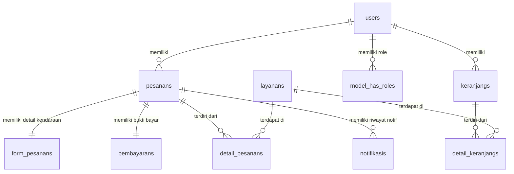

# 🚗 Official Website & Sistem Pemesanan Wrapping Premium — Dantie Sticker

Dokumentasi lengkap dan komprehensif mengenai arsitektur, basis data, alur kerja, dan konfigurasi teknis **Sistem Informasi Pemesanan Jasa Wrapping & Sticker Kendaraan** untuk **Dantie Sticker**. Dokumentasi ini disusun secara kronologis dan kompleks dari awal pembangunan sistem hingga menjadi aplikasi siap pakai saat ini.

---

## 📌 Daftar Isi
1. [Ringkasan Sistem](#-ringkasan-sistem)
2. [Teknologi yang Digunakan](#-teknologi-yang-digunakan)
3. [Arsitektur & Skema Basis Data](#-arsitektur--skema-basis-data)
4. [Manajemen Peran & Akses (RBAC)](#-manajemen-peran--akses-rbac)
5. [Evolusi Pengembangan Sistem (Dari Awal - Sekarang)](#-evolusi-pengembangan-sistem-dari-awal---sekarang)
6. [Fitur-Fitur Utama & Alur Kerja](#-fitur-fitur-utama--alur-kerja)
7. [Panduan Instalasi & Setup Lokal](#-panduan-instalasi--setup-lokal)
8. [Panduan Pemecahan Masalah (Troubleshooting)](#-panduan-pemecahan-masalah-troubleshooting)

---

## 🏢 Ringkasan Sistem
Sistem ini dirancang untuk mendigitalisasi seluruh alur bisnis **Dantie Sticker**, mulai dari branding profil perusahaan, penyajian katalog layanan interaktif, manajemen keranjang belanja, proses pemesanan dengan detail spesifikasi kendaraan, sistem verifikasi pembayaran, hingga pelaporan statistik penjualan secara real-time.

Sistem terbagi menjadi 2 area utama:
1. **Customer Facing Portal (Frontend):** Dibuat menggunakan **Laravel Breeze** yang telah dimodernisasi dengan desain visual premium berpola HSL & Glassmorphism, katalog dinamis, sistem checkout multi-step, dan riwayat pesanan.
2. **Administrative Back-office (Backend/Admin):** Dibuat menggunakan **Filament v3** yang disesuaikan untuk manajemen data cepat, verifikasi bukti pembayaran, manajemen CMS satu pintu, dan halaman statistik laporan penjualan kustom.

---

## ⚡ Teknologi yang Digunakan

| Sektor | Teknologi | Kegunaan |
| :--- | :--- | :--- |
| **Core Framework** | Laravel 10/11 | Fondasi backend robust, ORM Eloquent, dan struktur MVC. |
| **Admin Panel** | Filament v3 | Rapid-development admin panel dengan Livewire di dalamnya. |
| **Customer Auth** | Laravel Breeze | Autentikasi dasar yang ringan untuk pelanggan. |
| **Frontend Styling** | Tailwind CSS | Utility-first CSS untuk visual premium, responsif, dan dinamis. |
| **Asset Bundler** | Vite v6 | Kompilasi aset frontend super cepat untuk CSS & JS. |
| **Role Management** | Spatie Laravel Permission | Autentikasi berbasis peran (RBAC) admin vs user biasa. |
| **Icon Library** | Phosphor Icons (Web) | Library ikon minimalis, modern, dan sangat interaktif. |
| **Animations** | Animate On Scroll (AOS) | Animasi transisi konten premium di landing page. |

---

## 🗄️ Arsitektur & Skema Basis Data

Sistem ini memiliki **32 migrasi** yang membentuk struktur basis data relasional yang sangat kuat untuk mengakomodasi alur transaksi kompleks:



### 📋 Penjelasan Tabel Inti

1. **`users`**: Menyimpan kredensial pelanggan dan administrator.
2. **`roles` & `permissions`** (Spatie): Mengatur hak akses panel admin dan aksi di frontend.
3. **`profil_perusahaans`**: Tabel bergaya **Singleton** (hanya berisi 1 baris) untuk menampung seluruh konfigurasi CMS website (Judul Hero, Sejarah, Visi, Misi, Logo, alamat, media sosial, teks auth, testimonial JSON, dll.).
4. **`layanans`**: Menampung data paket layanan wrapping (kategori: Mobil, Motor, Sepeda; tipe: Fix/Custom; beserta deskripsi, harga, dan foto).
5. **`galeris`**: Galeri portofolio hasil pengerjaan tim Dantie Sticker untuk mengesankan calon pelanggan.
6. **`keranjangs` & `detail_keranjangs`**: Mengelola status item belanjaan yang dimasukkan pelanggan sebelum checkout.
7. **`pesanans`**: Transaksi induk yang menyimpan status pesanan (`menunggu_pembayaran`, `menunggu_verifikasi`, `dibayar`, `sedang_dikerjakan`, `selesai`, `dibatalkan`) dan total tagihan.
8. **`detail_pesanans`**: Relasi *pivot* yang menyimpan paket layanan apa saja yang dibeli pada satu pesanan beserta harga saat dibeli.
9. **`form_pesanans`**: Formulir kustom spesifikasi kendaraan pelanggan (Merek Kendaraan, Nomor Plat, Warna Asli, Warna Stiker Pilihan, Keterangan Tambahan).
10. **`pembayarans`**: Menyimpan data transaksi pembayaran (Metode Bayar, Bank Pengirim, Atas Nama, Jumlah Transfer, Bukti Foto Resi).
11. **`notifikasis` / `notifications`**: Pencatatan notifikasi sistem ke pelanggan ketika status pesanan berubah.

---

## 🔐 Manajemen Peran & Akses (RBAC)

Kami membagi hak akses secara ketat demi keamanan sistem menggunakan guard `web` dengan bantuan **Spatie Laravel Permission**:

```
                  ┌──────────────────────────────┐
                  │          Guard: web          │
                  └──────────────┬───────────────┘
                                 │
                 ┌───────────────┴───────────────┐
                 ▼                               ▼
       Role: user / customer                Role: admin
  ┌─────────────────────────────┐    ┌─────────────────────────────┐
  │ - Akses landing page        │    │ - Akses Filament (/admin)   │
  │ - Belanja di Katalog        │    │ - Kelola Data Master        │
  │ - Gunakan Keranjang & API   │    │ - Verifikasi Bukti Bayar    │
  │ - Checkout Multi-step Form  │    │ - Edit Konten CMS Web       │
  │ - Upload Bukti Pembayaran   │    │ - Cetak Laporan Penjualan   │
  └─────────────────────────────┘    └─────────────────────────────┘
```

---

## 📈 Evolusi Pengembangan Sistem (Dari Awal - Sekarang)

Sistem ini dibangun secara terstruktur melalui beberapa fase perkembangan utama:

### 🐣 Fase 1: Fondasi Awal & Autentikasi
* Inisialisasi proyek Laravel dan integrasi **Laravel Breeze** untuk mengamankan proses registrasi dan login customer.
* Instalasi **Spatie Laravel Permission** untuk memisahkan struktur role `admin` dan `user`.
* Integrasi **Filament v3** sebagai control panel backend bagi administrator di route `/admin`.

### 🏗️ Fase 2: Database Schema & Hubungan Relasional
* Merancang skema tabel dinamis untuk Layanan/Paket Wrapping dan Galeri Portofolio.
* Membangun sistem transaksi: tabel Keranjang (Cart), Pesanan (Order), Detail Pesanan, Form Kendaraan, dan Bukti Pembayaran.
* Pembuatan **Seeders** komprehensif (`RolesTableSeeder`, `PermissionsTableSeeder`, `UserTableSeeder`) untuk memudahkan replikasi data testing lokal dengan satu tombol.

### 🎨 Fase 3: Modernisasi Frontend & Dynamic CMS
* Mengubah website statis menjadi **Fully Dynamic CMS** dengan menghubungkannya ke model singleton `ProfilPerusahaan`. Administrator dapat mengedit slogan hero, visi misi, data kontak, logo, hingga footer langsung dari admin panel tanpa menyentuh kode program.
* Implementasi layout navigasi responsif, landing page interaktif dengan AOS, and sistem pemberitahuan *toast notification* real-time berbasis session Laravel.

### 🛒 Fase 4: Cart Engine, API & Multi-step Checkout
* Pembangunan **`KeranjangApiController`** untuk memproses manipulasi keranjang secara asinkronus (tambah, kurangi, hapus item) secara instan.
* Pembuatan halaman checkout modern yang memandu customer mengisi data spesifikasi kendaraan secara detail dan terstruktur (Plat nomor, warna asal, warna wrapping yang diinginkan).
* Integrasi **`PembayaranApiController`** yang memungkinkan customer mengunggah foto bukti resi transfer bank setelah checkout berhasil.

### 📱 Fase 5: Mobile Optimization & Bug Fixing (Terbaru)
* **Ngrok Tunnel Compatibility:** Penambahan middleware tepercaya dan pengaturan proxy pada web server agar customer dapat mencoba alur checkout secara utuh di HP melalui link Ngrok tanpa kendala error CSRF / Session drop.
* **Modernisasi Tombol Katalog Mobile:** Memperbaiki masalah padding non-standar (`px-5.5`) yang menyebabkan tombol filter pecah menjadi lingkaran aneh di mobile. Sekarang diubah menjadi desain *pill-button* premium (`px-6 py-2.5`) dengan ikon Phosphor (`ph-car`, `ph-motorcycle`, `ph-bicycle`, `ph-grid-four`) serta animasi responsif `active:scale-95`.
* **Perbaikan Laporan Penjualan Admin Panel:** Mengatasi masalah SVG ikon bawaan yang berukuran raksasa dan berantakan di Filament. Sekarang dilengkapi dengan *fixed dimensions styling* (`32px` & `16px`) serta CSS khusus yang responsif dan mendukung penuh **Dark/Light Mode**.

---

## ⚙️ Fitur-Fitur Utama & Alur Kerja

### 1. Sistem CMS Profil Perusahaan Satu Pintu
Admin dapat mengatur identitas brand Dantie Sticker secara penuh. Jika logo diubah di panel admin, maka logo di navbar customer, footer, dan invoice cetak otomatis berubah seketika.

### 2. Alur Pembelian Jasa (End-to-End Jasa Wrapping)
```
[Pilih Jasa di Katalog] ➔ [Masuk Keranjang] ➔ [Isi Detail Form Kendaraan] ➔ [Buat Pesanan] 
       ▲
       │
[Admin Verifikasi Pembayaran] ↞ [Customer Upload Resi Transfer] ↞ [Transfer Bank]
```

### 3. Ikon Filter Katalog Responsif & Modern
Pada resolusi mobile, filter kategori dapat digeser (horizontally scrollable) dengan efek geser tanpa scrollbar (`no-scrollbar`). Sentuhan micro-interactions (hover, active-scale) memberikan sensasi menggunakan aplikasi mobile native.

### 4. Custom Laporan Penjualan (Filament Page)
Halaman kustom di panel admin untuk mencetak laporan transaksi keuangan per periode:
* **Harian (Daily Report):** Monitoring omzet per hari ini.
* **Mingguan (Weekly Report):** Analisis grafik pendapatan 7 hari terakhir.
* **Bulanan (Monthly Report):** Rekapitulasi laporan bulanan untuk arsip perusahaan.

---

## 🚀 Panduan Instalasi & Setup Lokal

Ikuti langkah-langkah berikut untuk menjalankan proyek ini di komputer lokal Anda (disarankan menggunakan Laragon/XAMPP):

### 1. Kloning & Install Dependensi
```bash
# Masuk ke folder web server Anda (misal laragon/www)
cd d:/laragon/www/PBL-KULIAH/informasi_pemesanan_wrapping

# Install dependensi PHP (Composer)
composer install

# Install dependensi Javascript (NPM)
npm install
```

### 2. Konfigurasi Environment (`.env`)
Salin file `.env.example` menjadi `.env` lalu sesuaikan nama database Anda:
```env
DB_CONNECTION=mysql
DB_HOST=127.0.0.1
DB_PORT=3306
DB_DATABASE=informasi_pemesanan_wrapping
DB_USERNAME=root
DB_PASSWORD=
```

### 3. Jalankan Migrasi & Pengisian Data (Seeder)
Jalankan perintah ini untuk membangun seluruh tabel database, role, permission, serta akun default admin & user:
```bash
php artisan migrate:fresh --seed
```

### 4. Jalankan Server Pengembangan
Jalankan kedua terminal berikut secara bersamaan:
```bash
# Terminal 1: Menjalankan server Laravel
php artisan serve

# Terminal 2: Menjalankan Vite Asset compiler
npm run dev
# ATAU compile versi produksinya secara langsung:
npm run build
```

---

## 🔑 Kredensial Akun Default (Hasil Seeder)

Untuk mencoba kedua hak akses, gunakan akun hasil seeder berikut:

### 👤 Akun Pelanggan (Breeze Frontend)
* **URL Login:** `http://127.0.0.1:8000/login`
* **Email:** `izaldev@gmail.com`
* **Password:** `password`

### 👑 Akun Administrator (Filament Panel)
* **URL Panel:** `http://127.0.0.1:8000/admin`
* **Email:** `fauziahmad@gmail.com`
* **Password:** `kelompok3`

---

## 🛠️ Panduan Pemecahan Masalah (Troubleshooting)

### ⚠️ Masalah 1: Muncul Error "403 | Forbidden" saat membuka `/admin`
* **Penyebab:** Anda sedang aktif masuk sebagai pelanggan (`izaldev@gmail.com`) di browser tersebut, sehingga ditolak saat mengakses area admin karena role Anda adalah `user`.
* **Solusi:**
  1. Klik tombol **Keluar** (Logout) di pojok kanan atas dashboard customer terlebih dahulu.
  2. Atau, buka **Incognito Window (Mode Penyamaran)** baru di browser Anda lalu akses kembali `http://127.0.0.1:8000/admin`.

### ⚠️ Masalah 2: CSS / Gambar Pecah atau CSRF Token Mismatch di HP melalui Ngrok
* **Penyebab:** Ngrok mengirimkan header host proxy kustom yang ditolak secara default oleh Laravel demi keamanan, menyebabkan session tidak tersinkronisasi.
* **Solusi:**
  Pastikan server development lokal sudah dikonfigurasi untuk mempercayai seluruh proxy. Pastikan file `app/Http/Middleware/TrustProxies.php` diatur untuk menerima `TRUST_ALL_PROXIES` jika dijalankan melalui tunnel.

### ⚠️ Masalah 3: Perubahan Role di Database Tidak Berdampak pada Izin Akses
* **Penyebab:** Cache izin dari package Spatie Permission masih menahan data role yang lama.
* **Solusi:** Jalankan perintah pembersihan cache permission di terminal Anda:
  ```bash
  php artisan permission:cache-reset
  ```

---

*Hak Cipta &copy; 2026 Dantie Sticker & Tim PBL Kelompok 3. Seluruh hak cipta dilindungi.*